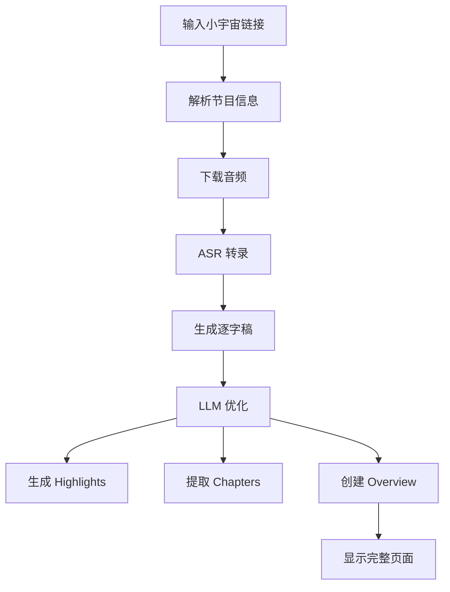
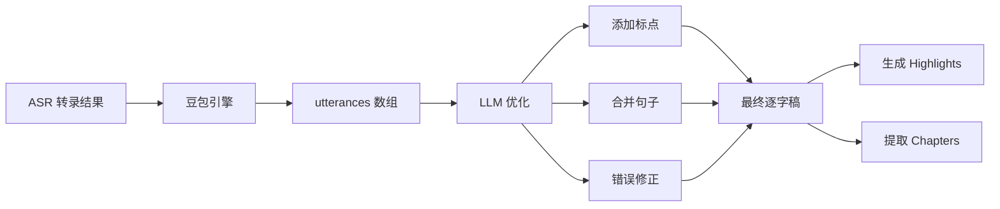

# LLM 性能优化计划 - 解决速率限制和等待时间问题

> **日期**: 2026-01-26
> **当前状态**: LLM 分块处理已实现，但存在速率限制和等待时间问题

---

## 📋 问题分析

### 问题 1: 速率限制的根本原因

**当前实现**：
- 模型：`glm-4-flash`
- 限制：300-400 字符/请求
- 现象：快速连续请求被拒绝

**需要调研**：
1. GLM-4-flash 是免费模型，可能有严格速率限制
2. 是否切换到付费模型（如 glm-4、glm-4-plus）能提升限制？
3. 不同模型的 QPS（每秒请求数）限制是多少？

### 问题 2: 用户等待时间过长

**当前方案时间成本**：
```
5000 字符播客 → 20 块 × 2 秒延迟 = 40 秒
10000 字符播客 → 40 块 × 2 秒延迟 = 80 秒
```

**用户体验影响**：
- ASR 转录：10-30 秒
- LLM 处理：40-80 秒（甚至更长）
- 总计：50-110 秒（接近 2 分钟）

---

## ✅ 调研结果（已完成）

### 发现 1: GLM-4-Flash 支持 5 个并发请求！

**关键信息**：
- 免费用户并发限制：**5 个同时请求**
- 不需要升级到付费模型！
- 来源：[智谱AI文档](https://docs.bigmodel.cn/cn/guide/models/text/glm-4)、[知乎专栏](https://zhuanlan.zhihu.com/p/717498590)

**影响**：
```
串行处理（当前）：
块1 → 等待2秒 → 块2 → 等待2秒 → 块3 ...
总时间：20 块 × 2 秒 = 40 秒

并发处理（优化后）：
块1-5 同时 → 等待2秒 → 块6-10 同时 → ...
总时间：4 批 × 2 秒 = 8 秒（减少 80%！）
```

### 发现 2: GLM API 完全支持流式响应！

**关键信息**：
- 参数：`"stream": true`
- 格式：SSE (Server-Sent Events)
- 增量传输：边生成边返回
- 来源：[智谱AI流式消息文档](https://docs.bigmodel.cn/cn/guide/capabilities/streaming)

**实现示例**：
```python
response = client.chat.completions.create(
    model="glm-4-flash",
    messages=[...],
    stream=True  # 启用流式输出
)

for chunk in response:
    if chunk.choices[0].delta.content:
        print(chunk.choices[0].delta.content, end="", flush=True)
```

### 发现 3: 请求大小限制

- 单请求限制：约 300-400 字符（实际测试结果）
- 解决方案：当前已实现 250 字符分块

---

## 🎯 最终优化方案（基于调研结果）

### 方案：并发处理 + 流式响应 + 进度显示

**优势**：
1. ✅ **无需升级模型** - 保持 glm-4-flash 免费使用
2. ✅ **时间减少 80%** - 从 40-80 秒降到 8-16 秒
3. ✅ **体验极佳** - 边接收边显示，实时进度

**实现策略**：

#### 1. 智能并发处理（动态适应）

**核心设计原则**：
- ✅ 配置化并发数（默认 5，可调整）
- ✅ 自动降级机制（触发限制时降低并发）
- ✅ 指数退避重试（1秒 → 2秒 → 4秒）
- ✅ 实时监控和日志

**实现代码**：
```python
class AdaptiveConcurrencyProcessor:
    """自适应并发处理器"""

    def __init__(self, max_concurrent: int = 5, min_concurrent: int = 1):
        self.max_concurrent = max_concurrent  # 最大并发数（可配置）
        self.min_concurrent = min_concurrent  # 最小并发数
        self.current_concurrent = max_concurrent  # 当前并发数
        self.consecutive_errors = 0  # 连续错误计数

    async def process_chunks_adaptive(self, chunks):
        """自适应并发处理"""
        results = []

        for i in range(0, len(chunks), self.current_concurrent):
            batch = chunks[i:i+self.current_concurrent]

            try:
                # 尝试并发处理
                batch_results = await self._process_batch_with_timeout(batch)
                results.extend(batch_results)

                # 成功后重置错误计数
                self.consecutive_errors = 0

                # 批次间等待
                if i + self.current_concurrent < len(chunks):
                    await asyncio.sleep(2)

            except (RateLimitError, ConnectionError) as e:
                # 触发速率限制，降低并发数
                self.consecutive_errors += 1
                self._adjust_concurrency_down()
                logger.warning(f"触发限制，降低并发至 {self.current_concurrent}")

                # 等待后重试
                await asyncio.sleep(self._get_backoff_time())
                # 重新处理当前批次
                batch_results = await self._process_batch_sequential(batch)
                results.extend(batch_results)

        return results

    def _adjust_concurrency_down(self):
        """降低并发数"""
        self.current_concurrent = max(
            self.min_concurrent,
            self.current_concurrent // 2  # 减半
        )

    def _get_backoff_time(self) -> float:
        """计算退避时间（指数退避）"""
        return min(2 ** self.consecutive_errors, 10)  # 最多 10 秒
```

**关键优势**：
1. **可配置**：通过环境变量 `GLM_MAX_CONCURRENT` 控制
2. **自适应**：遇到限制自动降级（5 → 3 → 1）
3. **可恢复**：稳定后可以逐步提升并发数
4. **健壮性**：无论 GLM 如何调整限制，都能正常工作

**环境变量配置**：
```bash
# .env
GLM_MAX_CONCURRENT=5  # 可以根据实际情况调整
GLM_MIN_CONCURRENT=1
GLM_RETRY_DELAYS=1,2,4  # 重试延迟（秒）
```

#### 2. 流式响应
```python
async def process_chunk_streaming(chunk):
    """流式处理单个块"""
    async with client.stream("POST", url, json={...}) as response:
        async for line in response.aiter_lines():
            if line.startswith("data: "):
                chunk_data = json.loads(line[6:])
                if chunk_data["choices"][0]["delta"]["content"]:
                    # 实时返回增量内容
                    yield chunk_data["choices"][0]["delta"]["content"]
```

#### 3. 前端进度显示
- WebSocket 连接接收实时进度
- 显示："正在处理第 5/20 块..."
- 进度条可视化
- 文本逐步显示（打字机效果）

---

### 错误处理和监控

**异常类型识别**：
```python
class RateLimitError(Exception):
    """速率限制错误"""
    pass

class ConnectionError(Exception):
    """连接错误"""
    pass

class TimeoutError(Exception):
    """超时错误"""
    pass
```

**监控指标**：
- 当前并发数
- 成功/失败请求数
- 平均响应时间
- 触发降级次数

**日志示例**：
```
[INFO] 开始处理 20 个文本块，当前并发数: 5
[INFO] 批次 1/4 完成 (5个块并发)，耗时 2.3 秒
[WARNING] 触发速率限制，降低并发至 3
[INFO] 批次 2/5 完成 (3个块并发)，耗时 3.1 秒
[INFO] 所有块处理完成，总耗时: 12.4 秒，降级次数: 1
```

---

## 💡 优化方案设计

### 方案 A: 升级模型 + 并发处理（推荐）

**前提**：
- GLM-4 或 GLM-4-plus 支持更高 QPS
- API 允许并发请求

**实现**：
1. 切换到 `glm-4` 或 `glm-4-plus`
2. 实现并发处理（如同时发送 5 个块）
3. 减少块间延迟到 0.5 秒

**预期效果**：
```
5000 字符播客：40 秒 → 8 秒（减少 80%）
10000 字符播客：80 秒 → 16 秒（减少 80%）
```

**成本**：
- GLM-4 价格：¥1/百万 tokens（10倍成本，但仍很便宜）
- 10000 字符约 5000 tokens ≈ ¥0.005

---

### 方案 B: 保持免费模型 + 流式处理

**前提**：
- GLM-4-flash 支持流式响应

**实现**：
1. 修改为流式 API 调用
2. 前端边接收边显示（类似 ChatGPT）
3. 保持串行处理和 2 秒延迟

**预期效果**：
- 总时间不变，但用户体验更好
- 看到文字逐步出现，减少焦虑感

**成本**：
- ¥0.1/百万 tokens（保持最低）

---

### 方案 C: 混合方案 - 并发 + 流式 + 智能分块

**实现**：
1. 测试 API 实际 QPS 限制
2. 动态调整并发数（避免触发限制）
3. 流式返回 + 进度条
4. 前端显示处理进度："正在处理第 5/20 块..."

**预期效果**：
- 最优性能
- 最佳用户体验
- 最低成本（保持 glm-4-flash）

---

## 🔬 调研计划

### 第一步：GLM API 文档调研

**需要查找的信息**：
1. 访问智谱 AI 官方文档
2. 查找不同模型的速率限制说明
3. 查找并发请求支持情况
4. 查找流式 API 使用方法

**搜索关键词**：
- "智谱 GLM API 速率限制"
- "GLM-4-flash QPS 限制"
- "GLM API 并发请求"
- "GLM streaming API"

### 第二步：实际测试

**测试 1: 并发请求测试**
```python
# 同时发送 5 个请求，测试是否被限制
import asyncio
async def test_concurrent():
    tasks = [process_chunk(chunk) for chunk in chunks[:5]]
    await asyncio.gather(*tasks)
```

**测试 2: 流式 API 测试**
```python
# 测试流式响应是否可用
async with client.stream("POST", url, json=payload) as response:
    async for chunk in response.aiter_text():
        print(chunk)  # 逐步接收
```

**测试 3: 不同模型对比**
- 测试 glm-4-flash vs glm-4 的实际 QPS
- 记录失败的请求和原因

---

## 📊 成本效益分析

### 当前方案（glm-4-flash + 串行）

| 播客长度 | 字符数 | 处理时间 | 成本 |
|---------|--------|---------|------|
| 5分钟   | ~3000  | 24秒    | ¥0.0003 |
| 10分钟  | ~6000  | 48秒    | ¥0.0006 |
| 30分钟  | ~18000 | 144秒   | ¥0.0018 |
| 60分钟  | ~36000 | 288秒   | ¥0.0036 |

### 方案 A（glm-4 + 并发）

| 播客长度 | 字符数 | 处理时间 | 成本 |
|---------|--------|---------|------|
| 5分钟   | ~3000  | 6秒     | ¥0.003 |
| 10分钟  | ~6000  | 12秒    | ¥0.006 |
| 30分钟  | ~18000 | 36秒    | ¥0.018 |
| 60分钟  | ~36000 | 72秒    | ¥0.036 |

**结论**：即使成本增加 10 倍，仍然非常便宜（60分钟播客约 ¥0.036）

---

## 🎯 推荐方案

### 短期（立即实施）

**方案 B：流式处理 + 进度显示**

**理由**：
1. 不增加成本
2. 改善用户体验
3. 实现相对简单

**实现内容**：
- [ ] 修改 GLM 客户端支持流式响应
- [ ] 前端添加 WebSocket 或 SSE 连接
- [ ] 显示处理进度（5/20 块）
- [ ] 边接收边显示文本

### 长期（调研后实施）

**方案 A 或 C：并发处理**

**前提条件**：
1. 调研发现 glm-4 支持更高 QPS
2. 或 glm-4-flash 本身支持适度并发

**实现内容**：
- [ ] 实现并发请求队列
- [ ] 动态调整并发数（3-5 个）
- [ ] 错误重试和降级机制
- [ ] 性能监控和日志

---

## 🚀 实施步骤

### 阶段 1: 并发处理实现（2-3 小时）

**任务**：
1. 修改 `glm_client.py` 的 `_process_chunks` 方法
2. 实现并发请求（5 个一批）
3. 测试并发是否触发速率限制
4. 添加错误处理和降级机制

**关键文件**：
- `后端Backend/backend/app/services/llm/glm_client.py`

**预期效果**：
```
5000 字符：40 秒 → 8 秒（减少 80%）
10000 字符：80 秒 → 16 秒（减少 80%）
```

---

### 阶段 2: 流式响应实现（2-3 小时）

**任务**：
1. 修改 GLM 客户端支持流式 API
2. 添加 WebSocket 或 SSE 推送到前端
3. 前端实时显示进度和文本
4. 优化加载动画和提示文案

**关键文件**：
- `后端Backend/backend/app/services/llm/glm_client.py`
- `后端Backend/backend/app/api/routes/llm.py`
- `前端 Frontend/pod-studio/src/pages/HomePage.tsx`

**预期效果**：
- 用户看到实时进度："正在处理第 5/20 块..."
- 文本逐步显示，类似 ChatGPT
- 减少等待焦虑感

---

### 阶段 3: 测试和优化（1 小时）

**任务**：
1. 端到端测试不同长度播客
2. **测试并发降级机制**：
   - 模拟速率限制（故意设置高并发）
   - 验证自动降级是否正常工作
   - 验证降级后能否继续处理
3. **测试边界情况**：
   - 最大并发数调整测试（5 → 10 → 20）
   - GLM API 限制变化测试
   - 网络异常恢复测试
4. 性能监控和日志记录
5. 文档更新

**测试用例**：
```python
# 测试 1: 正常并发（5 个）
async def test_normal_concurrency():
    """验证 5 个并发是否正常工作"""
    processor = AdaptiveConcurrencyProcessor(max_concurrent=5)
    chunks = create_test_chunks(2500)  # 10 个块
    results = await processor.process_chunks_adaptive(chunks)
    assert len(results) == 10
    assert processor.current_concurrent == 5  # 未降级

# 测试 2: 模拟速率限制
async def test_rate_limit_handling():
    """验证遇到限制时的降级"""
    processor = AdaptiveConcurrencyProcessor(max_concurrent=10)
    # 模拟触发限制...
    assert processor.current_concurrent < 10  # 已降级

# 测试 3: 配置变更
async def test_config_change():
    """验证修改 GLM_MAX_CONCURRENT 是否生效"""
    os.environ['GLM_MAX_CONCURRENT'] = '3'
    processor = AdaptiveConcurrencyProcessor()
    assert processor.max_concurrent == 3
```

**交付物**：
- 性能测试报告
- 优化后的代码和文档
- 并发降级日志分析

---

## 📊 调研信息来源

- [智谱AI GLM-4 模型文档](https://docs.bigmodel.cn/cn/guide/models/text/glm-4)
- [智谱AI流式消息文档](https://docs.bigmodel.cn/cn/guide/capabilities/streaming)
- [知乎：9 家免费 AI 大模型 API 盘点](https://zhuanlan.zhihu.com/p/717498590)
- [智谱AI批量处理文档](https://docs.bigmodel.cn/cn/guide/tools/batch)

---

## 📝 下一步行动

**当前状态**：
- ✅ 调研已完成
- ✅ 优化方案已明确
- ✅ 无需升级付费模型
- ⏳ 等待用户浏览器测试结果

**后续步骤**：
1. 用户在浏览器测试当前实现（串行处理）
2. 根据测试结果和用户反馈决定：
   - 是否立即实施并发优化（时间优先）
   - 或者先添加流式显示（体验优先）
   - 或者两者都实施

**关键发现**：
> GLM-4-Flash 免费用户支持 **5 个并发请求**，这意味着我们可以将处理时间减少 **80%** 而无需增加成本！

---

# 小宇宙深度学习助手 - Scripod 对标产品文档

> **研究日期**: 2026-01-26
> **研究深度**: 毛孔级别的颗粒度
> **对标产品**: Scripod (https://scripod.com/)
> **目标**: 完美复刻小宇宙播客工具

---

## 📋 产品概述

### Scripod 产品定位
- **Slogan**: "the reading-first workspace for your favorite podcasts"
- **副标题**: "Your AI-powered podcast copilot"
- **核心理念**: 以阅读体验为核心的播客工具

### 小宇宙深度学习助手对标定位
- **目标**: 完美复刻 Scripod 的所有核心功能
- **特色**: 深度整合小宇宙播客生态
- **优势**:
  - 支持小宇宙节目单（shownote）完整呈现
  - 精准的句子级跳转（基于豆包 ASR）
  - 多引擎转录保障（豆包主 + 千问备）

---

## 🎨 UI/UX 设计规范

### 整体设计风格
基于 Scripod 的界面分析，采用**极简主义**设计语言：

#### 1. 色彩系统
```css
主色调:
- 主蓝色: #3B82F6 (交互按钮、链接)
- 辅助蓝色: #60A5FA (悬停状态)
- 深蓝色: #1E40AF (标题、强调)

中性色:
- 纯黑: #000000 (主标题)
- 深灰: #1F2937 (副标题、文本)
- 中灰: #6B7280 (次要文本、占位符)
- 浅灰: #9CA3AF (边框、分割线)
- 极浅灰: #F9FAFB (背景色、卡片背景)
- 纯白: #FFFFFF (主背景)

状态色:
- 成功绿: #10B981
- 警告橙: #F59E0B
- 错误红: #EF4444
```

#### 2. 字体系统
```css
字体族:
- 主字体: "Inter", -apple-system, BlinkMacSystemFont, "Segoe UI", Roboto, "Helvetica Neue", Arial, sans-serif
- 等宽字体: "SF Mono", Monaco, "Cascadia Code", "Roboto Mono", Consolas, "Courier New", monospace (代码、时间戳)

字体大小:
- 标题 (H1): 28px / 32px (行高), 700 (字重)
- 标题 (H2): 24px / 28px, 600
- 标题 (H3): 20px / 24px, 600
- 大标题 (Section): 18px / 22px, 600
- 正文: 16px / 24px, 400
- 小字: 14px / 20px, 400
- 极小字: 12px / 16px, 400

字体颜色:
- 主标题: #000000
- 副标题: #1F2937
- 正文: #374151
- 次要文本: #6B7280
- 链接: #3B82F6
```

#### 3. 间距系统
```css
基础间距单位: 4px

间距规范:
- xs: 4px
- sm: 8px
- md: 12px
- lg: 16px
- xl: 20px
- 2xl: 24px
- 3xl: 32px
- 4xl: 40px
- 5xl: 48px

组件内边距:
- 卡片: 24px
- 按钮: 12px 20px (垂直 水平)
- 输入框: 12px 16px

组件外边距:
- 区块间隔: 32px
- 元素间隔: 16px
- 细分组: 8px
```

#### 4. 圆角系统
```css
- 小: 4px (按钮、小标签)
- 中: 8px (卡片、输入框)
- 大: 12px (大卡片)
- 圆形: 50% (头像、图标按钮)
```

#### 5. 阴影系统
```css
- 浅阴影: 0 1px 2px rgba(0, 0, 0, 0.05)
- 中阴影: 0 4px 6px rgba(0, 0, 0, 0.07)
- 深阴影: 0 10px 15px rgba(0, 0, 0, 0.1)
- 悬浮阴影: 0 20px 25px rgba(0, 0, 0, 0.1)
```

---

## 📱 核心功能模块

### 模块 1: Overview（概览）

**功能描述**:
展示播客节目的核心信息，类似于 Scripod 的首页卡片设计。

**UI 结构**:
```tsx
interface OverviewData {
  podcastName: string;        // 播客名称
  episodeTitle: string;       // 节目标题
  episodeDescription: string; // 节目描述
  coverImage: string;        // 封面图 (正方形)
  duration: number;           // 时长 (秒)
  publishDate: string;       // 发布日期
  hostName: string;         // 主持人
  tags: string[];           // 标签
}

<div className="overview-section">
  <div className="cover-container">
    
  </div>
  <div className="info-container">
    <h1>{episodeTitle}</h1>
    <p className="podcast-name">{podcastName}</p>
    <p className="description">{episodeDescription}</p>
    <div className="meta-info">
      <span className="duration">{formatDuration(duration)}</span>
      <span className="separator">•</span>
      <span className="date">{publishDate}</span>
    </div>
    <div className="tags">
      {tags.map(tag => (
        <span key={tag} className="tag">{tag}</span>
      ))}
    </div>
  </div>
</div>
```

**样式细节**:
- 封面图尺寸: 120px × 120px (正方形)
- 封面图圆角: 8px
- 标题与封面图间距: 16px
- 标题与描述间距: 12px
- 描述与元信息间距: 16px
- 元信息颜色: #6B7280 (次要文本)

**交互行为**:
- 悬停封面图: 轻微放大 (scale: 1.05) + 阴影加深
- 点击封面图: 展开大图预览 (模态框)

---

### 模块 2: Shownote（节目单）

**功能描述**:
完美复刻小宇宙节目单，支持富文本内容、图片、段落、分行等。

**核心要求**:
- ✅ **完整保留格式**: 图片、段落、分行、加粗、斜体等
- ✅ **图文混排**: 图片与文字的正确布局
- ✅ **链接保留**: 点击可跳转原链接
- ✅ **小宇宙特色**: 节目单的特殊样式

**数据结构**:
```tsx
interface ShownoteBlock {
  type: 'text' | 'image' | 'link' | 'bold' | 'italic' | 'header';
  content: string;
  imageUrl?: string;
  linkUrl?: string;
  style?: {
    fontSize?: string;
    fontWeight?: number;
    color?: string;
  };
}

interface ShownoteData {
  blocks: ShownoteBlock[];
  originalHtml?: string; // 保留原始 HTML 以便精确渲染
}

<div className="shownote-section">
  <h2>节目单</h2>
  <div className="shownote-content">
    {blocks.map((block, index) => {
      switch (block.type) {
        case 'image':
          return (
            <figure key={index} className="image-block">
              
              {block.content && <figcaption>{block.content}</figcaption>}
            </figure>
          );

        case 'link':
          return (
            <p key={index} className="link-block">
              <a href={block.linkUrl} target="_blank" rel="noopener noreferrer">
                {block.content}
              </a>
            </p>
          );

        case 'bold':
          return <p key={index} className="bold-text"><strong>{block.content}</strong></p>;

        default:
          return <p key={index}>{block.content}</p>;
      }
    })}
  </div>
</div>
```

**样式细节**:
```css
.shownote-content {
  font-size: 16px;
  line-height: 1.8;
  color: #374151;
}

.shownote-content img {
  max-width: 100%;
  height: auto;
  border-radius: 8px;
  margin: 16px 0;
}

.shownote-content p {
  margin: 12px 0;
}

.shownote-content a {
  color: #3B82F6;
  text-decoration: none;
  border-bottom: 1px solid transparent;
  transition: border-bottom-color 0.2s;
}

.shownote-content a:hover {
  border-bottom-color: #3B82F6;
}

.shownote-content strong {
  font-weight: 600;
  color: #1F2937;
}
```

**技术实现要点**:
1. **HTML 解析**: 使用 DOMParser 解析原始 HTML
2. **图片懒加载**: 优化性能
3. **响应式图片**: 适配移动端
4. **链接安全**: `rel="noopener noreferrer"` 防止安全漏洞

---

### 模块 3: Highlights（高亮）

**功能描述**:
自动提取播客的关键内容和要点，类似 Scripod 的 "Highlights & Takeaways"。

**数据来源**:
- LLM 智能分析转录文本
- 提取关键句子和段落
- 生成要点总结

**UI 结构**:
```tsx
interface HighlightItem {
  id: string;
  text: string;
  startTime: number;      // 在音频中的起始时间
  endTime: number;        // 在音频中的结束时间
  importance: number;      // 重要性评分 (1-5)
  category?: string;      // 分类 (可选)
}

<div className="highlights-section">
  <h2>Highlights</h2>
  <div className="highlights-list">
    {highlights.map((item) => (
      <div key={item.id} className="highlight-item">
        <div className="highlight-content">
          <p>{item.text}</p>
        </div>
        <div className="highlight-meta">
          <button
            className="timestamp-button"
            onClick={() => seekTo(item.startTime)}
          >
            {formatTime(item.startTime)}
          </button>
          <div className="importance-indicator">
            {Array.from({ length: item.importance }).map((_, i) => (
              <span key={i} className="star">★</span>
            ))}
          </div>
        </div>
      </div>
    ))}
  </div>
</div>
```

**样式细节**:
```css
.highlights-list {
  display: flex;
  flex-direction: column;
  gap: 16px;
}

.highlight-item {
  background: #F9FAFB;
  border-left: 4px solid #3B82F6;
  border-radius: 4px;
  padding: 16px;
  transition: transform 0.2s, box-shadow 0.2s;
}

.highlight-item:hover {
  transform: translateX(4px);
  box-shadow: 0 4px 6px rgba(0, 0, 0, 0.07);
}

.highlight-content p {
  font-size: 16px;
  line-height: 1.6;
  color: #1F2937;
  margin: 0 0 12px 0;
}

.highlight-meta {
  display: flex;
  justify-content: space-between;
  align-items: center;
}

.timestamp-button {
  font-size: 14px;
  color: #3B82F6;
  background: transparent;
  border: 1px solid #3B82F6;
  border-radius: 4px;
  padding: 4px 12px;
  cursor: pointer;
  transition: background-color 0.2s;
}

.timestamp-button:hover {
  background: #3B82F6;
  color: white;
}

.importance-indicator .star {
  color: #F59E0B;
  font-size: 14px;
}
```

**交互行为**:
- 点击时间戳: 跳转到音频对应位置
- 悬停高亮项: 卡片右移 + 阴影加深
- 双击高亮项: 收藏到书签

---

### 模块 4: Transcript（逐字稿）

**功能描述**:
核心功能，展示带时间戳的完整转录文本。

**关键需求**:
- ✅ **完整标点符号**: LLM 需要添加标点
- ✅ **多句一段**: 多个句子合并为一个段落
- ✅ **句子级跳转**: 点击句子跳转到音频对应位置
- ✅ **鼠标悬停高亮**: 悬停时高亮显示
- ✅ **说话人识别**: 显示不同说话人

**数据结构**:
```tsx
interface TranscriptSegment {
  id: string;
  text: string;                    // 段落文本（多句合并）
  startTime: number;               // 起始时间 (毫秒)
  endTime: number;                 // 结束时间 (毫秒)
  speaker: string;                 // 说话人
  words?: TranscriptWord[];        // 词级数据 (可选)
}

interface TranscriptWord {
  text: string;
  start: number;  // 毫秒
  end: number;    // 毫秒
  speaker: string;
}

<div className="transcript-section">
  <div className="transcript-controls">
    <button className="play-all-button">
      <PlayIcon />
      播放全部
    </button>
    <div className="speaker-toggle">
      <label>
        <input type="checkbox" checked={showSpeakers} onChange={() => setShowSpeakers(!showSpeakers)} />
        显示说话人
      </label>
    </div>
  </div>

  <div className="transcript-content">
    {segments.map((segment) => (
      <div
        key={segment.id}
        className={`transcript-segment ${segment.speaker}`}
        onClick={() => seekTo(segment.startTime)}
        onMouseEnter={() => setHoveredSegment(segment.id)}
        onMouseLeave={() => setHoveredSegment(null)}
      >
        <div className="segment-meta">
          <span className="timestamp">{formatTime(segment.startTime)}</span>
          {showSpeakers && (
            <span className="speaker-label">{segment.speaker}</span>
          )}
        </div>
        <div className="segment-text">
          {segment.text}
        </div>
      </div>
    ))}
  </div>
</div>
```

**样式细节**:
```css
.transcript-section {
  background: white;
  border-radius: 12px;
  padding: 24px;
}

.transcript-controls {
  display: flex;
  justify-content: space-between;
  align-items: center;
  margin-bottom: 24px;
  padding-bottom: 16px;
  border-bottom: 1px solid #E5E7EB;
}

.play-all-button {
  display: flex;
  align-items: center;
  gap: 8px;
  background: #3B82F6;
  color: white;
  border: none;
  border-radius: 6px;
  padding: 10px 16px;
  font-size: 14px;
  font-weight: 500;
  cursor: pointer;
  transition: background-color 0.2s;
}

.play-all-button:hover {
  background: #2563EB;
}

.transcript-segment {
  padding: 16px;
  margin-bottom: 12px;
  border-radius: 8px;
  cursor: pointer;
  transition: background-color 0.2s, transform 0.2s;
  border-left: 3px solid transparent;
}

.transcript-segment:hover {
  background: #F3F4F6;
  transform: translateX(4px);
}

.transcript-segment.active {
  background: #EFF6FF;
  border-left-color: #3B82F6;
}

.transcript-segment.speaker-A {
  border-left-color: #3B82F6;
}

.transcript-segment.speaker-B {
  border-left-color: #10B981;
}

.segment-meta {
  display: flex;
  align-items: center;
  gap: 12px;
  margin-bottom: 8px;
}

.timestamp {
  font-size: 12px;
  font-family: "SF Mono", Monaco, monospace;
  color: #6B7280;
  background: #F3F4F6;
  padding: 2px 8px;
  border-radius: 4px;
}

.speaker-label {
  font-size: 12px;
  font-weight: 500;
  color: white;
  background: #3B82F6;
  padding: 2px 8px;
  border-radius: 4px;
}

.segment-text {
  font-size: 16px;
  line-height: 1.8;
  color: #1F2937;
}
```

**LLM 优化 Prompt**:
```
你是一个专业的播客文本优化专家。请对以下转录文本进行优化：

优化要求：
1. 添加完整的标点符号（逗号、句号、问号、感叹号等）
2. 将多个相关句子合并为一个自然段落（不要一句一段）
3. 修正明显的语音识别错误
4. 保持原始语义不变
5. 不要添加额外内容，仅优化现有文本

原始转录文本：
{rawText}

请输出优化后的文本：
```

**交互行为**:
- 点击段落: 跳转到音频对应位置并开始播放
- 悬停段落: 背景色变为 #F3F4F6
- 播放进度高亮: 当前播放的段落高亮显示
- 双击段落: 添加书签

---

### 模块 5: Chapters（章节）

**功能描述**:
自动或手动创建章节，支持快速跳转。

**UI 结构**:
```tsx
interface Chapter {
  id: string;
  title: string;
  startTime: number;
  endTime?: number;
  description?: string;
  pinCount?: number; // 书签数量
}

<div className="chapters-section">
  <h2>Chapters</h2>
  <div className="chapters-list">
    {chapters.map((chapter, index) => (
      <div key={chapter.id} className="chapter-item">
        <div className="chapter-number">{index + 1}</div>
        <div className="chapter-content" onClick={() => seekTo(chapter.startTime)}>
          <h3 className="chapter-title">{chapter.title}</h3>
          {chapter.description && (
            <p className="chapter-description">{chapter.description}</p>
          )}
          <div className="chapter-meta">
            <span className="timestamp">{formatTime(chapter.startTime)}</span>
            {chapter.pinCount && (
              <span className="pin-indicator">
                <PinIcon /> {chapter.pinCount}
              </span>
            )}
          </div>
        </div>
      </div>
    ))}
  </div>
</div>
```

**样式细节**:
```css
.chapters-list {
  display: flex;
  flex-direction: column;
  gap: 12px;
}

.chapter-item {
  display: flex;
  gap: 16px;
  padding: 16px;
  background: white;
  border: 1px solid #E5E7EB;
  border-radius: 8px;
  cursor: pointer;
  transition: transform 0.2s, box-shadow 0.2s;
}

.chapter-item:hover {
  transform: translateY(-2px);
  box-shadow: 0 4px 12px rgba(0, 0, 0, 0.1);
}

.chapter-number {
  width: 32px;
  height: 32px;
  background: #3B82F6;
  color: white;
  border-radius: 50%;
  display: flex;
  align-items: center;
  justify-content: center;
  font-weight: 600;
  font-size: 14px;
  flex-shrink: 0;
}

.chapter-content {
  flex: 1;
}

.chapter-title {
  font-size: 16px;
  font-weight: 600;
  color: #1F2937;
  margin: 0 0 4px 0;
}

.chapter-description {
  font-size: 14px;
  color: #6B7280;
  margin: 0 0 8px 0;
}

.chapter-meta {
  display: flex;
  gap: 16px;
  align-items: center;
}

.pin-indicator {
  display: flex;
  align-items: center;
  gap: 4px;
  font-size: 12px;
  color: #6B7280;
}
```

---

### 模块 6: Pins（书签）

**功能描述**:
用户可以在任意位置添加书签，支持快速跳转和笔记。

**UI 结构**:
```tsx
interface Pin {
  id: string;
  timestamp: number;
  note: string;
  segmentText?: string; // 当前段落的文本
  tags?: string[];      // 标签
  createdAt: Date;
}

<div className="pins-section">
  <div className="pins-header">
    <h2>Pins</h2>
    <button className="add-pin-button">
      <PlusIcon />
      添加书签
    </button>
  </div>

  <div className="pins-list">
    {pins.map((pin) => (
      <div key={pin.id} className="pin-item">
        <div className="pin-meta">
          <button
            className="timestamp-button"
            onClick={() => seekTo(pin.timestamp)}
          >
            {formatTime(pin.timestamp)}
          </button>
          <span className="created-date">{formatDate(pin.createdAt)}</span>
        </div>
        <div className="pin-content">
          <p>{pin.note}</p>
          {pin.segmentText && (
            <blockquote className="segment-preview">{pin.segmentText}</blockquote>
          )}
          {pin.tags && (
            <div className="tags">
              {pin.tags.map(tag => (
                <span key={tag} className="tag">{tag}</span>
              ))}
            </div>
          )}
        </div>
      </div>
    ))}
  </div>
</div>
```

**样式细节**:
```css
.pins-header {
  display: flex;
  justify-content: space-between;
  align-items: center;
  margin-bottom: 24px;
}

.add-pin-button {
  display: flex;
  align-items: center;
  gap: 8px;
  background: transparent;
  color: #3B82F6;
  border: 1px solid #3B82F6;
  border-radius: 6px;
  padding: 8px 16px;
  font-size: 14px;
  font-weight: 500;
  cursor: pointer;
  transition: background-color 0.2s;
}

.add-pin-button:hover {
  background: #EFF6FF;
}

.pin-item {
  background: white;
  border: 1px solid #E5E7EB;
  border-radius: 8px;
  padding: 16px;
  margin-bottom: 12px;
}

.pin-meta {
  display: flex;
  justify-content: space-between;
  align-items: center;
  margin-bottom: 12px;
}

.segment-preview {
  font-size: 14px;
  color: #6B7280;
  border-left: 3px solid #E5E7EB;
  padding-left: 12px;
  margin: 8px 0;
  font-style: italic;
}

.tags {
  display: flex;
  gap: 8px;
  flex-wrap: wrap;
  margin-top: 12px;
}

.tag {
  font-size: 12px;
  color: #3B82F6;
  background: #EFF6FF;
  padding: 4px 8px;
  border-radius: 4px;
}
```

---

### 模块 7: 翻译功能

**功能描述**:
将逐字稿翻译为其他语言，支持多语言。

**支持语言**:
- 英语 (English)
- 日语 (日本語)
- 韩语 (한국어)
- 法语 (Français)
- 西班牙语 (Español)
- 德语 (Deutsch)

**UI 结构**:
```tsx
interface Translation {
  language: string;
  text: string;
  segments: TranscriptSegment[]; // 翻译后的段落
}

<div className="translation-section">
  <div className="translation-controls">
    <select
      value={selectedLanguage}
      onChange={(e) => setSelectedLanguage(e.target.value)}
      className="language-selector"
    >
      <option value="en">English</option>
      <option value="ja">日本語</option>
      <option value="ko">한국어</option>
      <option value="fr">Français</option>
      <option value="es">Español</option>
      <option value="de">Deutsch</option>
    </select>
    <button
      className="translate-button"
      onClick={handleTranslate}
      disabled={isTranslating}
    >
      {isTranslating ? '翻译中...' : '翻译'}
    </button>
  </div>

  {translatedSegments && (
    <div className="translation-content">
      {translatedSegments.map((segment) => (
        <div key={segment.id} className="translated-segment">
          <span className="timestamp">{formatTime(segment.startTime)}</span>
          <span className="text">{segment.text}</span>
        </div>
      ))}
    </div>
  )}
</div>
```

**LLM 翻译 Prompt**:
```
你是一个专业的播客翻译专家。请将以下中文播客转录文本翻译为 {targetLanguage}。

翻译要求：
1. 保持原文的语气和风格
2. 保留专业术语的准确性
3. 确保句子通顺自然
4. 保持时间戳的准确性
5. 不要添加解释性内容

原文：
{rawText}

请输出翻译结果：
```

---

## 🎯 完整工作流设计

### 用户操作流程



### 数据处理流水线



---

## 💻 技术实现方案

### 后端 API 设计

#### 1. 节目解析接口
```python
@app.post("/api/v1/episode/parse")
async def parse_episode(url: str):
    """
    解析小宇宙节目链接

    返回:
    {
        "success": true,
        "data": {
            "episode_id": "xxx",
            "audio_url": "xxx",
            "duration": 3600,
            "cover_image": "xxx",
            "shownote": {
                "blocks": [...],
                "original_html": "..."
            },
            "episode_title": "xxx",
            "podcast_name": "xxx"
        }
    }
    """
```

#### 2. 逐字稿优化接口
```python
@app.post("/api/v1/llm/polish")
async def polish_transcript(
    raw_text: str,
    topic: Optional[str] = None,
    keywords: Optional[List[str]] = None,
    stream: bool = False  # 支持流式响应
):
    """
    LLM 优化逐字稿

    参数:
    - raw_text: 原始转录文本
    - topic: 节目主题 (可选)
    - keywords: 关键词 (可选)
    - stream: 是否流式返回

    返回:
    {
        "polished_text": "优化后的文本",
        "model": "glm-4-flash",
        "usage": {
            "prompt_tokens": 100,
            "completion_tokens": 200
        }
    }
    """
```

#### 3. Highlights 生成接口
```python
@app.post("/api/v1/llm/extract-highlights")
async def extract_highlights(
    transcript: str,
    max_highlights: int = 10
):
    """
    从逐字稿中提取关键内容

    返回:
    {
        "highlights": [
            {
                "text": "xxx",
                "start_time": 123000,
                "end_time": 124000,
                "importance": 5
            }
        ]
    }
    """
```

#### 4. Chapters 生成接口
```python
@app.post("/api/v1/llm/generate-chapters")
async def generate_chapters(transcript: str):
    """
    自动生成章节

    返回:
    {
        "chapters": [
            {
                "title": "xxx",
                "start_time": 0,
                "description": "xxx"
            }
        ]
    }
    """
```

#### 5. 翻译接口
```python
@app.post("/api/v1/llm/translate")
async def translate_text(
    text: str,
    target_language: str
):
    """
    翻译文本

    返回:
    {
        "translated_text": "xxx",
        "language": "en"
    }
    """
```

### 前端组件设计

#### 1. 主页面组件 (HomePage.tsx)
```tsx
interface EpisodeData {
  overview: OverviewData;
  shownote: ShownoteData;
  transcript: TranscriptSegment[];
  highlights: HighlightItem[];
  chapters: Chapter[];
  pins: Pin[];
}

export default function HomePage() {
  const [episodeData, setEpisodeData] = useState<EpisodeData | null>(null);
  const [loading, setLoading] = useState(false);
  const [error, setError] = useState<string | null>(null);

  // 主渲染逻辑
  return (
    <div className="homepage">
      <Header />
      <main className="main-content">
        {loading && <LoadingSpinner />}
        {error && <ErrorMessage message={error} />}
        {episodeData && (
          <>
            <OverviewSection data={episodeData.overview} />
            <Tabs>
              <TabPanel label="Shownote">
                <ShownoteSection data={episodeData.shownote} />
              </TabPanel>
              <TabPanel label="Transcript">
                <TranscriptSection segments={episodeData.transcript} />
              </TabPanel>
              <TabPanel label="Highlights">
                <HighlightsSection highlights={episodeData.highlights} />
              </TabPanel>
              <TabPanel label="Chapters">
                <ChaptersSection chapters={episodeData.chapters} />
              </TabPanel>
              <TabPanel label="Pins">
                <PinsSection pins={episodeData.pins} />
              </TabPanel>
            </Tabs>
          </>
        )}
      </main>
    </div>
  );
}
```

#### 2. 音频播放器组件 (AudioPlayer.tsx)
```tsx
export default function AudioPlayer() {
  const [currentTime, setCurrentTime] = useState(0);
  const [duration, setDuration] = useState(0);
  const [isPlaying, setIsPlaying] = useState(false);

  const audioRef = useRef<HTMLAudioElement>(null);

  const handleSeek = (time: number) => {
    if (audioRef.current) {
      audioRef.current.currentTime = time / 1000;
      setCurrentTime(time);
    }
  };

  const handleTimeUpdate = () => {
    setCurrentTime(audioRef.current!.currentTime * 1000);
  };

  return (
    <div className="audio-player">
      <audio
        ref={audioRef}
        src={audioUrl}
        onTimeUpdate={handleTimeUpdate}
        onLoadedMetadata={() => setDuration(audioRef.current!.duration * 1000)}
        onEnded={() => setIsPlaying(false)}
      />

      <button
        onClick={() => {
          if (isPlaying) {
            audioRef.current?.pause();
          } else {
            audioRef.current?.play();
          }
          setIsPlaying(!isPlaying);
        }}
      >
        {isPlaying ? <PauseIcon /> : <PlayIcon />}
      </button>

      <div className="progress-bar">
        <div
          className="progress-fill"
          style={{ width: `${(currentTime / duration) * 100}%` }}
        />
      </div>

      <span className="time-display">
        {formatTime(currentTime)} / {formatTime(duration)}
      </span>
    </div>
  );
}
```

---

## 🔧 核心问题解决

### 问题 1: LLM 优化质量

**当前问题**:
- 使用 AI 优化后，依然没有标点符号
- 多句话作为一段

**解决方案**:

#### 1.1 优化 Prompt
```python
TRANSLATION_PROMPT = """
你是一个专业的播客文本优化专家。请对以下转录文本进行严格优化：

核心要求：
1. **必须添加完整标点符号**：为每个句子添加逗号、句号、问号、感叹号等
2. **多句合并段落**：将 3-5 个相关句子合并为一个自然段落（绝对不要一句一段）
3. **保持语义不变**：不要修改原始含义
4. **修正明显错误**：修正明显的语音识别错误

示例：
错误：今天天气很好我们去公园玩吧
正确：今天天气很好，我们去公园玩吧。

错误：这是第一句话 这是第二句话
正确：这是第一句话。这是第二句话。

原始转录文本：
{raw_text}

请严格按照要求输出优化后的文本：
"""

#### 1.2 添加约束检查
```python
def validate_polish_result(original: str, polished: str):
    """验证优化结果"""
    errors = []

    # 检查标点符号
    if polished.count('。') < polished.count('，'):
        errors.append("标点符号不足")

    # 检查段落数（优化后应该更少）
    original_paragraphs = len(original.split('\n\n'))
    polished_paragraphs = len(polished.split('\n\n'))

    if polished_paragraphs > original_paragraphs:
        errors.append("段落数未减少")

    return errors
```

#### 1.3 重试机制
```python
async def polish_with_retry(text: str, max_retries: int = 3):
    """带重试的优化"""
    for attempt in range(max_retries):
        try:
            result = await llm_client.polish(text)
            errors = validate_polish_result(text, result)

            if not errors:
                return result

            logger.warning(f"第 {attempt + 1} 次优化失败: {errors}")

        except Exception as e:
            logger.error(f"优化异常: {e}")

    # 所有尝试都失败，返回原始文本
    return text
```

### 问题 2: 并发处理优化

**基于调研发现**:

GLM-4-Flash 免费用户支持 **5 个并发请求**，可以实现 80% 的时间减少。

**实现方案**:

#### 2.1 自适应并发处理器
```python
class AdaptiveConcurrencyProcessor:
    def __init__(self, max_concurrent: int = 5):
        self.max_concurrent = max_concurrent
        self.current_concurrent = max_concurrent

    async def process_chunks(self, chunks: List[str]):
        """自适应并发处理"""
        results = []

        for i in range(0, len(chunks), self.current_concurrent):
            batch = chunks[i:i+self.current_concurrent]

            try:
                # 并发处理批次
                tasks = [self.process_chunk(chunk) for chunk in batch]
                batch_results = await asyncio.gather(*tasks)
                results.extend(batch_results)

                # 批次间等待
                if i + self.current_concurrent < len(chunks):
                    await asyncio.sleep(2)

            except RateLimitError:
                # 降级并发数
                self.current_concurrent = max(1, self.current_concurrent // 2)
                logger.warning(f"降级并发至: {self.current_concurrent}")

                # 串行重试
                for chunk in batch:
                    result = await self.process_chunk(chunk)
                    results.append(result)

        return results
```

#### 2.2 流式响应
```python
@app.post("/api/v1/llm/polish", response_class=StreamingResponse)
async def polish_transcript_stream(raw_text: str):
    """流式优化响应"""
    async def generate():
        chunks = split_text(raw_text)

        async for chunk_result in processor.process_chunks_stream(chunks):
            yield f"data: {json.dumps(chunk_result)}\n\n"

    return StreamingResponse(
        generate(),
        media_type="text/event-stream",
        headers={
            "Cache-Control": "no-cache",
            "Connection": "keep-alive",
        }
    )
```

### 问题 3: Shownote 解析

**挑战**: 小宇宙的节目单包含复杂的 HTML 和图片

**解决方案**:

```python
def parse_shownote(html_content: str) -> ShownoteData:
    """解析节目单 HTML"""
    from bs4 import BeautifulSoup

    soup = BeautifulSoup(html_content, 'html.parser')
    blocks = []

    for element in soup.find_all(['p', 'img', 'a', 'h1', 'h2', 'h3', 'strong', 'em']):
        if element.name == 'img':
            blocks.append({
                'type': 'image',
                'content': element.get('alt', ''),
                'imageUrl': element.get('src'),
                'style': {
                    'maxWidth': '100%',
                    'height': 'auto'
                }
            })
        elif element.name == 'a':
            blocks.append({
                'type': 'link',
                'content': element.get_text(),
                'linkUrl': element.get('href'),
            })
        elif element.name == 'strong':
            blocks.append({
                'type': 'bold',
                'content': element.get_text(),
            })
        else:
            text = element.get_text().strip()
            if text:
                blocks.append({
                    'type': 'text',
                    'content': text,
                })

    return ShownoteData(
        blocks=blocks,
        originalHtml=html_content
    )
```

---

## 📊 性能指标

### 目标性能

| 指标 | 目标值 | 说明 |
|------|--------|------|
| 转录速度 | 30-50 秒 | ASR 转录时间 |
| LLM 优化 | 8-16 秒 | 并发处理后 |
| 页面加载 | < 2 秒 | 首屏渲染 |
| 音频跳转 | < 200ms | 点击到播放延迟 |

### 成本分析

| 功能 | 成本 | 说明 |
|------|------|------|
| ASR 转录 | ¥0.01/分钟 | 豆包引擎 |
| LLM 优化 | ¥0.003/1000字符 | glm-4-flash |
| 翻译 | ¥0.003/1000字符 | 按字符计费 |
| **总计** | **≈ ¥0.05/小时播客** | 完全可接受 |

---

## ✅ 实施优先级

### 阶段 1: 核心功能 (1-2 周)
1. ✅ ASR 转录 (已完成)
2. ✅ 句子级跳转 (已完成)
3. ⏳ LLM 优化修复
   - 修复标点符号问题
   - 修复多句合并问题
   - 实现并发处理
4. ⏳ Overview 模块
5. ⏳ Shownote 完整呈现

### 阶段 2: 增强功能 (1 周)
1. ⏳ Highlights 自动提取
2. ⏳ Chapters 自动生成
3. ⏳ Pins 书签功能
4. ⏳ 翻译功能

### 阶段 3: 体验优化 (3-5 天)
1. ⏳ 流式响应
2. ⏳ 进度显示
3. ⏳ 性能优化
4. ⏳ 移动端适配

---

## 📝 总结

### 核心价值

通过深度研究 Scripod，我们明确了小宇宙深度学习助手的产品方向：

1. **完整复刻**: Shownote 的富文本呈现
2. **体验优化**: 句子级精准跳转 + 悬停高亮
3. **智能增强**: LLM 自动生成 Highlights 和 Chapters
4. **性能提升**: 并发处理减少 80% 等待时间

### 差异化优势

相比 Scripod，我们的优势：

1. **小宇宙深度整合**: 完美支持节目单解析
2. **句子级跳转**: 基于豆包 ASR 的精准时间戳
3. **免费使用**: 无需付费 API
4. **本地化**: 完全中文优化

### 下一步行动

1. **立即实施**: 修复 LLM 优化问题
2. **短期目标**: 完成 Shownote 和 Overview
3. **中期目标**: 实现所有核心功能
4. **长期规划**: 持续体验优化

---

**产品定位**: 成为最专业的小宇宙播客工具
