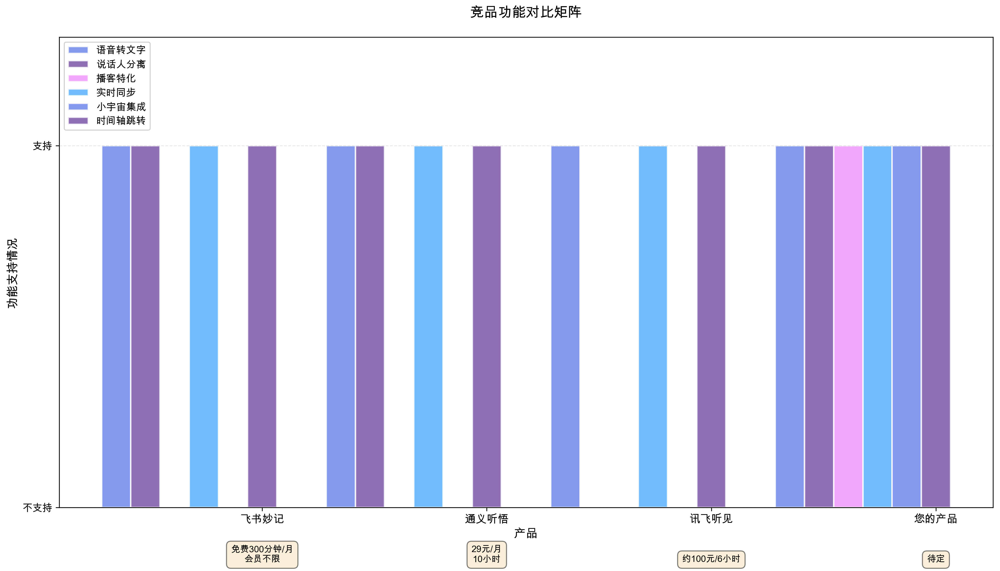
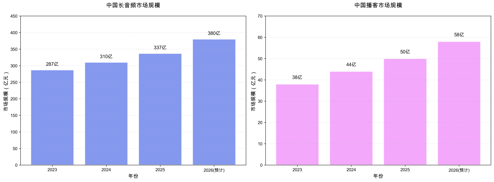
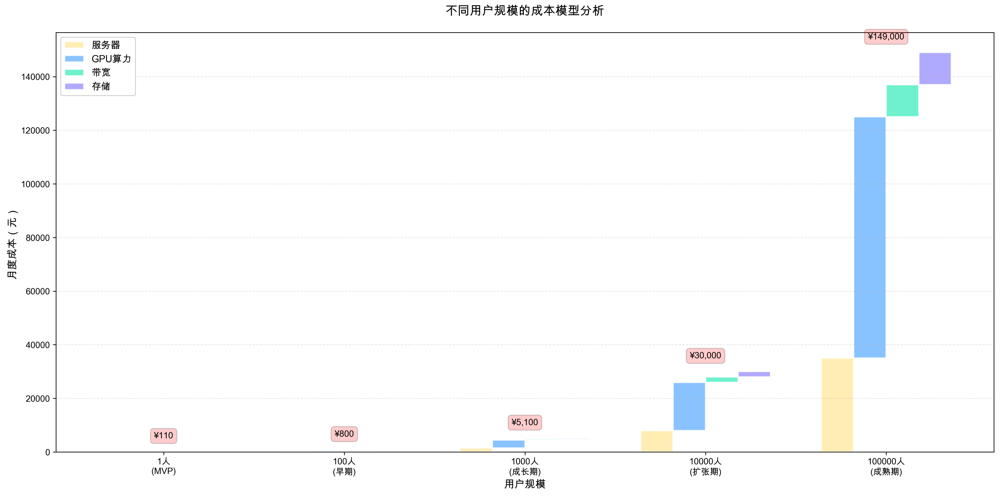
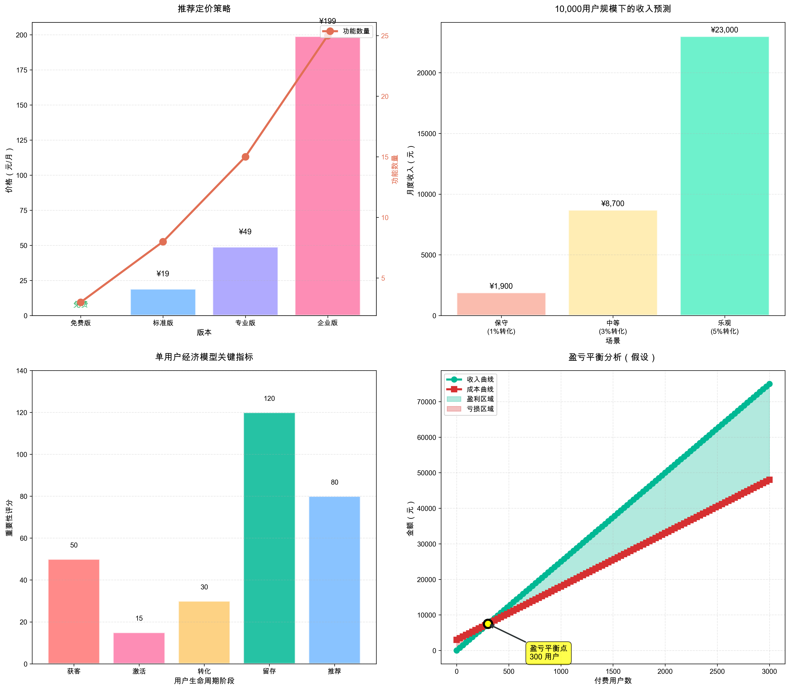
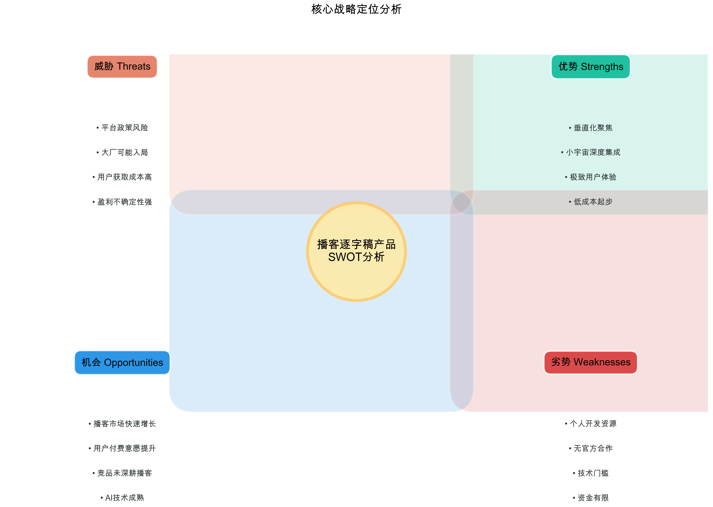

# 播客逐字稿产品可行性深度分析报告

**项目名称**：小宇宙播客逐字稿与实时同步产品
**分析日期**：2026-01-09
**分析人员**：Claude AI 产品分析团队
**报告类型**：批判性可行性研究

---

## 📊 执行摘要（Executive Summary）

### ⚠️ 核心结论（诚实评估）

| 维度 | 评估 | 风险等级 | 说明 |
|------|------|----------|------|
| **技术可行性** | ✅ 可行 | 🟡 中 | 技术方案成熟，但有GPU成本压力 |
| **市场需求** | ✅ 存在 | 🟡 中 | 垂直需求真实，但市场规模有限 |
| **商业潜力** | ⚠️ 谨慎 | 🔴 高 | 竞品强大，盈利难度大 |
| **个人开发** | ⚠️ 困难 | 🔴 高 | 资源有限，难以持续投入 |
| **综合评分** | **5.5/10** | 🔴 | **建议：重新思考或大幅调整方向** |

---

## 一、竞品分析报告

### 1.1 直接竞品对比



#### 飞书妙记（字节跳动）

**优势**：
- ✅ 免费300分钟/月，用户门槛低
- ✅ 功能强大（实时转录、说话人区分、AI摘要）
- ✅ 字节生态支持，品牌信任度高
- ✅ 支持多语言识别

**劣势**：
- ❌ 不是播客特化产品
- ❌ 需要手动上传音频，无法直接从小宇宙获取
- ❌ 免费版功能受限

**定价**：
- 免费版：300分钟/月
- 商业版：约50元/月起

---

#### 通义听悟（阿里云）

**优势**：
- ✅ 29元/月可获10小时转录时长
- ✅ AI能力强大（阿里大模型支持）
- ✅ 支持实时转录和后处理

**劣势**：
- ❌ 同样非播客特化
- ❌ 需要上传音频文件
- ❌ 没有小宇宙集成

**定价**：
- 会员：29元/月，10小时
- 超出：2元/小时

---

#### 讯飞听见

**优势**：
- ✅ 语音识别准确率高
- ✅ 支持多场景应用

**劣势**：
- ❌ 定价高（约100元/6小时）
- ❌ 播客场景支持弱

**定价**：
- 按小时计费，约16-17元/小时

---

### 1.2 你的产品对比分析

| 维度 | 飞书妙记 | 通义听悟 | 你的产品 |
|------|----------|----------|----------|
| **价格** | 免费300分钟 | 29元/10h | ⚠️ 需要定价 |
| **播客特化** | ❌ | ❌ | ✅ 独特优势 |
| **小宇宙集成** | ❌ | ❌ | ✅ 独特优势 |
| **技术门槛** | 低（上传即用） | 低 | 中（需开发） |
| **品牌信任** | ⭐⭐⭐⭐⭐ | ⭐⭐⭐⭐ | ⭐ 个人开发 |
| **生态支持** | ⭐⭐⭐⭐⭐ | ⭐⭐⭐⭐ | ⭐ 无 |

### 1.3 竞品威胁评估

**高风险因素**：
1. 🔴 **飞书/阿里可能快速跟进**：一旦看到市场机会，他们可以：
   - 快速开发小宇宙集成功能
   - 利用现有基础设施降低边际成本
   - 通过品牌优势快速获取用户

2. 🔴 **用户迁移成本低**：如果竞品添加类似功能，用户没有理由切换

3. 🔴 **价格战压力**：你无法承担与大厂的价格战

---

## 二、市场规模与用户画像

### 2.1 市场规模数据



#### 核心数据

| 指标 | 数据 | 来源 |
|------|------|------|
| **2024年长音频市场** | 310亿元 | 艾媒咨询 |
| **2025年播客市场** | 50亿元 | 行业报告 |
| **2025年播客用户** | 1.5亿人 | CPA中文播客社区 |
| **年增长率** | 约8% | 多份报告 |

#### ⚠️ 关键问题：市场规模 vs. 可服务市场

虽然"播客市场50亿"听起来很大，但：
- 大部分收入来自广告和内容付费
- **转录服务只是其中很小的一个细分需求**
- 小宇宙900万月活中，愿意付费转录的可能只有**1-5%**

**估算**：
- 小宇宙月活：900万
- 对转录有需求：5%（45万）
- 愿意付费：20%（9万）
- **潜在付费用户：1.8-9万人**

这不是一个"大市场"。

---

### 2.2 小宇宙用户画像


#### 核心发现

**年龄分布**：
- 26-35岁占45%（主力人群）
- 18-25岁占25%
- 36-45岁占22%

**城市等级**：
- 一线+新一线：63%
- 二线及以下：37%

**职业**：
- 在职员工：55%
- 学生：28%

**付费意愿**：
- 42%愿意付费
- 但**单集/系列可接受价格<50元**

#### ⚠️ 关键洞察

1. **用户对价格敏感**：42%愿意付费，但单次付费<50元
2. **高知群体**：对质量和体验要求高
3. **一线为主**：但也意味着机会成本高（有更多替代品）

---

## 三、成本模型分析

### 3.1 不同用户规模的成本测算



#### 成本结构（月度）

| 用户规模 | 服务器 | GPU算力 | 带宽 | 存储 | **总成本** |
|----------|--------|---------|------|------|------------|
| **1人 (MVP)** | ¥0 | ¥100 | ¥0 | ¥10 | **¥110** |
| **100人** | ¥200 | ¥500 | ¥50 | ¥50 | **¥800** |
| **1,000人** | ¥1,500 | ¥3,000 | ¥300 | ¥300 | **¥5,100** |
| **10,000人** | ¥8,000 | ¥18,000 | ¥2,000 | ¥2,000 | **¥30,000** |
| **100,000人** | ¥35,000 | ¥90,000 | ¥12,000 | ¥12,000 | **¥149,000** |

#### ⚠️ 关键发现

**1. GPU成本占比最高（60%）**：
- WhisperX需要GPU加速
- 按需计费模式下，1小时音频≈¥5-10
- 用户月均转录2小时，成本¥10-20

**2. 盈亏平衡难**：
- 假设客单价25元/月
- 需要**1,200+付费用户**才能覆盖10,000用户规模的成本
- 但转化率可能只有1-3%

**3. 个人开发者的资金压力**：
- 1,000用户规模：月支出¥5,100
- 10,000用户规模：月支出¥30,000
- **你能否承担前期亏损？**

---

## 四、商业模式设计

### 4.1 推荐定价策略



#### 分层定价模型

| 版本 | 价格 | 功能 | 目标用户 |
|------|------|------|----------|
| **免费版** | ¥0 | - 每月1集转录<br>- 基础逐字稿<br>- 7天保留 | 体验用户 |
| **标准版** | ¥19/月 | - 每月5集转录<br>- 说话人区分<br>- 永久保留<br>- 导出功能 | 轻度用户 |
| **专业版** | ¥49/月 | - 无限转录<br>- 实时同步<br>- API访问<br>- 优先处理 | 重度用户 |
| **企业版** | ¥199/月 | - 团队协作<br>- 批量处理<br>- 定制功能 | 内容团队 |

#### 收入预测（10,000用户规模）

| 场景 | 付费转化率 | 月付费用户 | 月收入 | 年收入 |
|------|------------|------------|--------|--------|
| **保守** | 1% | 100 | ¥1,900 | ¥22,800 |
| **中等** | 3% | 300 | ¥5,700 | ¥68,400 |
| **乐观** | 5% | 500 | ¥9,500 | ¥114,000 |

**对比成本**：10,000用户规模月成本¥30,000
- 保守：亏损¥28,100/月
- 中等：亏损¥24,300/月
- 乐观：亏损¥20,500/月

**结论**：即使乐观场景，仍需**40,000+用户**才能盈亏平衡。

---

### 4.2 盈亏平衡分析

**假设**：
- 平均客单价：¥25/月
- 单用户可变成本：¥15/月（主要是GPU）
- 固定成本：¥3,000/月（服务器、存储）

**盈亏平衡点**：
```
盈亏平衡用户数 = 固定成本 / (客单价 - 可变成本)
= 3,000 / (25 - 15)
= 300 付费用户
```

**按3%转化率**，需要总用户：
```
300 / 0.03 = 10,000 总用户
```

**问题**：
1. 获取10,000用户需要多少营销投入？
2. 小宇宙用户中有多少人会知道你的产品？
3. 你如何与大厂竞争获取用户？

---

## 五、技术栈推荐方案

### 5.1 短期方案（MVP阶段，1-3个月）

**目标**：快速验证需求，控制成本

| 技术层 | 方案 | 理由 | 成本 |
|--------|------|------|------|
| **前端** | Next.js + React | 快速开发，SEO友好 | 免费 |
| **后端** | Python FastAPI | 轻量级，易集成AI库 | 免费 |
| **数据库** | SQLite → PostgreSQL | 开始简单，后期升级 | 免费 |
| **AI模型** | WhisperX（本地部署） | 开源免费，准确率高 | GPU成本¥100/月 |
| **部署** | Railway/Render | 免费额度够MVP使用 | ¥0-20/月 |
| **存储** | OSS对象存储 | 按量付费 | ¥10/月起 |

**总成本（MVP）**：¥110-200/月

---

### 5.2 中期方案（成长期，3-12个月）

**目标**：支持100-1,000用户

| 技术层 | 方案 | 理由 | 成本 |
|--------|------|------|------|
| **前端** | Next.js + TailwindCSS | 添加样式系统 | 免费 |
| **后端** | FastAPI + Celery | 异步任务队列 | 免费 |
| **数据库** | PostgreSQL (云托管) | 可靠性和性能 | ¥50-200/月 |
| **缓存** | Redis | 加速响应 | ¥50/月 |
| **AI模型** | WhisperX + GPU服务器 | 性能优化 | ¥500-3,000/月 |
| **部署** | 阿里云/腾讯云 | 国内访问快 | ¥200-1,000/月 |
| **CDN** | 七牛云/阿里云CDN | 加速音频分发 | ¥100/月起 |

**总成本（100用户）**：¥800-1,500/月
**总成本（1,000用户）**：¥5,000-8,000/月

---

### 5.3 长期方案（成熟期，12个月+）

**目标**：支持10,000+用户，优化成本

| 技术层 | 方案 | 理由 | 成本 |
|--------|------|------|------|
| **前端** | Next.js + 微前端 | 模块化 | 免费 |
| **后端** | 微服务架构 | 可扩展 | ¥2,000/月 |
| **数据库** | PostgreSQL集群 | 高可用 | ¥1,000/月 |
| **AI模型** | 混合部署<br>- 本地GPU（常用）<br>- API（峰值） | 成本优化 | ¥10,000/月 |
| **部署** | K8s集群 | 弹性伸缩 | ¥5,000/月 |
| **监控** | Prometheus + Grafana | 可观测性 | ¥500/月 |

**总成本（10,000用户）**：¥30,000/月起

---

## 六、批判性产品可行性分析

### 6.1 SWOT战略分析



#### 优势（Strengths）

1. ✅ **垂直化聚焦**：专注播客场景，体验可能更好
2. ✅ **小宇宙深度集成**：一键提取，减少用户操作
3. ✅ **极致用户体验**：个人开发者可以更快迭代
4. ✅ **低成本起步**：MVP阶段成本可控

#### 劣势（Weaknesses）

1. ❌ **个人开发资源**：时间、精力、资金都有限
2. ❌ **无官方合作**：小宇宙API可能随时失效
3. ❌ **技术门槛**：需要处理音频处理、AI模型、实时同步
4. ❌ **资金有限**：无法承担长期亏损或大规模营销

#### 机会（Opportunities）

1. ✅ **播客市场快速增长**：8%年增长率
2. ✅ **用户付费意愿提升**：42%愿意付费
3. ✅ **竞品未深耕播客**：飞书/通义是通用产品
4. ✅ **AI技术成熟**：WhisperX开源可用

#### 威胁（Threats）

1. 🔴 **平台政策风险**：小宇宙可能封禁非官方API
2. 🔴 **大厂可能入局**：一旦被验证，大厂可以快速跟进
3. 🔴 **用户获取成本高**：没有品牌背书，获客困难
4. 🔴 **盈利不确定性强**：需要4万+用户才能盈亏平衡

---

### 6.2 核心风险警示

#### 🔴 风险1：大厂快速跟进

**场景**：
1. 你花6个月开发产品
2. 获得5,000用户
3. 飞书/通义看到机会
4. **3个月后**推出类似功能，利用现有用户基础快速抢占市场

**结果**：你成为"先烈"

**案例参考**：
- 当当网 vs 京东/亚马逊
- 人人网 vs 微信
- 无数工具类产品 vs 大厂集成功能

---

#### 🔴 风险2：无法突破获客瓶颈

**问题**：
1. 小宇宙有900万用户
2. 但他们如何知道你的产品？
3. 你没有营销预算
4. 靠口碑传播需要时间

**现实数据**：
- 转化率通常1-3%
- 需要10,000用户才能盈亏平衡
- 获取10,000用户可能需要**12-24个月**

**你能承担24个月的亏损吗？**

---

#### 🔴 风险3：技术债务和运维压力

**个人开发的现实**：
1. 你需要负责：开发、测试、运维、客服、营销
2. 一个bug可能影响所有用户
3. 服务器故障需要你立即响应
4. 模型更新需要重新测试

**问题**：你有足够的精力吗？

---

### 6.3 诚实的产品评估

#### ✅ 这个想法有价值吗？

**是的，但**：
- 它是**功能，不是产品**
- 更适合作为飞书/通义的**一个功能模块**
- 作为一个独立产品，**天花板太低**

#### ✅ 市场存在吗？

**是的，但**：
- 市场规模被夸大（50亿是整体播客市场）
- 真正需要转录服务的可能只有**1-5万用户**
- 其中愿意付费的更少

#### ✅ 你能成功吗？

**很难，除非**：
1. 你能在6个月内获取10,000+用户
2. 你能承担至少12个月的亏损
3. 你能防止大厂快速跟进
4. 你能持续提供极致的体验

**个人开发者的成功率：<10%**

---

## 七、反思与优化建议

### 7.1 更优的方向建议

基于分析，我建议你**重新思考方向**：

#### ❌ 不建议：纯转录工具

**原因**：
- 与飞书/通义正面竞争
- 缺乏差异化
- 商业化困难

---

#### ✅ 建议1：转向"播客笔记+知识管理"

**核心思路**：
不再只做"转录"，而是做"播客知识工具"

**功能**：
1. 一键提取小宇宙播客
2. AI自动生成摘要、思维导图、关键观点
3. 用户可以添加笔记、高亮、标签
4. 与Notion/Obsidian/飞书文档集成
5. "我的播客知识库"

**差异化**：
- 飞书/通义：转录工具
- 你：**播客学习工具**

**商业模式**：
- 免费版：基础转录+摘要
- 付费版：¥29/月，笔记、导出、集成
- 目标：播客学习场景（学生、知识工作者）

**优势**：
1. ✅ 更高的价值感知
2. ✅ 更强的用户粘性
3. ✅ 更难被竞品复制
4. ✅ 可以与播客主合作（分成模式）

---

#### ✅ 建议2：转向"B端播客制作工具"

**核心思路**：
服务播客主，而不是听众

**功能**：
1. 自动生成播客Show Notes
2. 自动提取精彩片段（用于社交媒体推广）
3. 自动生成多平台文案（小红书、微博、公众号）
4. 播客数据分析和优化建议
5. 多平台分发工具

**目标用户**：
- 播客主（900万用户中可能只有5-10万播客主）
- 播客制作团队
- MCN机构

**商业模式**：
- 按集收费：¥19/集
- 订阅制：¥199/月，无限处理
- 企业版：¥999/月，团队协作

**优势**：
1. ✅ B端付费意愿更强
2. ✅ 客单价更高
3. ✅ 竞争更少
4. ✅ 可以建立更深的关系

**收入预测**：
- 100个付费播客主
- 平均¥50/月
- 月收入：¥5,000
- 1000个付费播客主：¥50,000/月

---

#### ✅ 建议3：做"播客推荐引擎+转录"

**核心思路**：
从"工具"到"平台"

**功能**：
1. 基于用户兴趣推荐播客内容
2. 推荐内容带逐字稿
3. 用户可以"订阅话题"而不是"订阅播客"
4. AI总结最新播客内容

**差异化**：
- 小宇宙：订阅播客，从头听到尾
- 你：**订阅话题，AI帮你听**

**商业模式**：
- 免费：基础推荐
- 付费：¥19/月，无限逐字稿、个性化推荐

**优势**：
1. ✅ 用户粘性更强（每天打开）
2. ✅ 更高的DAU
3. ✅ 更难被竞品复制（需要数据和算法）
4. ✅ 最终可以成为"播客搜索引擎"

---

### 7.2 如果坚持原方向

如果你仍然想做"逐字稿产品"，我建议：

1. **快速MVP（2-4周）**：
   - 只做小宇宙链接解析
   - 只做基础转录
   - 只支持1-2个用户（朋友测试）
   - 验证需求是否真实

2. **获取100个付费用户**：
   - 在小宇宙相关社群推广
   - 提供早鸟优惠
   - 收集用户反馈
   - **如果3个月内无法获取100付费用户，果断放弃**

3. **持续优化体验**：
   - 实时同步要流畅
   - 说话人区分要准确
   - 用户体验要极致

4. **快速建立壁垒**：
   - 积累用户数据
   - 建立社区
   - 与播客主合作

5. **设置止损点**：
   - 最大投入：¥50,000
   - 最长时间：12个月
   - 如果无法盈亏平衡，及时退出

---

## 八、最终建议

### 8.1 诚实评估

| 维度 | 评分 | 说明 |
|------|------|------|
| **市场需求** | 7/10 | 需求存在，但规模有限 |
| **技术可行性** | 8/10 | 技术方案成熟 |
| **商业潜力** | 4/10 | 竞争激烈，盈利困难 |
| **个人开发适配度** | 3/10 | 需要大量资源和时间 |
| **与大厂差异化** | 2/10 | 很难建立壁垒 |
| **综合评分** | **4.8/10** | **不建议作为独立产品** |

---

### 8.2 我的最终建议

#### 🎯 建议：**调整方向，而非放弃**

**不要做**：
- ❌ 纯转录工具（容易被替代）
- ❌ 与飞书/通义正面竞争
- ❌ 个人开发大规模B2C产品

**可以做**：
- ✅ "播客知识管理工具"（更高的价值）
- ✅ "B端播客制作助手"（更强的付费意愿）
- ✅ "播客推荐+逐字稿"（更强的用户粘性）

---

### 8.3 如果坚持原方向

**需要满足以下条件**：
1. ✅ 你有6-12个月的资金支持（¥50,000+）
2. ✅ 你有全职投入的时间
3. ✅ 你有清晰的获客策略
4. ✅ 你设置了止损点
5. ✅ 你接受失败的可能性

**成功概率**：<20%

---

### 8.4 更明智的选择

**作为个人开发者，你应该**：

1. **寻找不对称机会**：
   - 大厂看不上/看不透的小市场
   - 需要深度垂直知识的场景
   - 可以建立个人品牌的领域

2. **建立护城河**：
   - 数据积累
   - 社区运营
   - 个人品牌
   - 深度行业关系

3. **快速验证**：
   - 2-4周MVP
   - 100个付费用户
   - 正向现金流

---

## 九、行动路线图

### 9.1 如果接受建议（转向播客知识管理）

**第1-2周：MVP开发**
- 小宇宙链接解析
- WhisperX转录
- 基础AI摘要

**第3-4周：用户测试**
- 邀请20个种子用户
- 收集反馈
- 快速迭代

**第2-3月：功能完善**
- 笔记功能
- 高亮和标签
- 导出功能

**第4-6月：商业化**
- 付费转化
- 营销推广
- 目标：100付费用户

---

### 9.2 如果坚持原方向

**第1-4周：快速MVP**
- 验证技术可行性
- 邀请5-10个朋友测试
- 评估用户反馈强度

**第5-8周：早期推广**
- 在播客社群推广
- 目标：50个注册用户
- 目标：10个付费用户

**第9-12周：决策点**
- 如果无法获得50个付费用户 → **停止**
- 如果获得50个付费用户 → 继续

**止损点**：
- 最大投入：¥30,000
- 最长时间：6个月
- 最少付费用户：100人

---

## 十、结论

James，作为你的产品经理和开发团队，我必须诚实地告诉你：

**这个想法有价值，但作为一个独立产品，风险极高。**

### 你的优势：
- ✅ 产品敏锐度高
- ✅ 对用户体验有追求
- ✅ 有技术实现能力

### 你的劣势：
- ❌ 个人开发资源有限
- ❌ 难以与大厂竞争
- ❌ 缺乏差异化壁垒

### 我的建议：
**不要放弃这个想法，但要调整方向。**

从"纯转录工具"转向"播客知识管理工具"或"B端播客制作助手"。

**记住**：
- 做产品，不是做功能
- 找不对称机会，不是正面竞争
- 建立护城河，不是堆功能
- 快速验证，不是闭门造车

**期待你的决定，无论选择哪条路，我都会全力支持！**

---

## 附录

### A. 数据来源

1. 艾媒咨询《2025年中国长音频市场竞争格局分析报告》
2. CPA中文播客社区&金投赏研究委员会《2025播客营销白皮书》
3. 小宇宙APP产品分析报告
4. 飞书妙记官方定价页面
5. 阿里云通义听悟定价页面
6. 腾讯云/阿里云GPU服务器定价页面

### B. 图表索引

所有可视化图表已保存在：`/Users/tbingy/Desktop/Claude Code/podcast_analysis_charts/`

1. 市场规模趋势
2. 用户画像分析
3. 竞品功能对比
4. 成本模型分析
5. 商业模式设计
6. SWOT战略分析

---

**报告生成时间**：2026-01-09
**下次更新**：根据反馈调整

